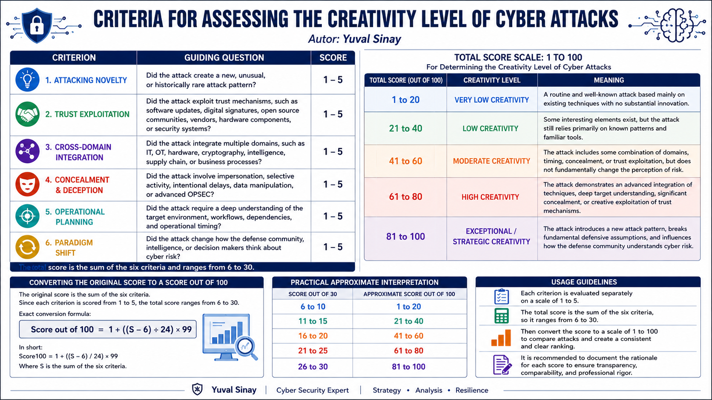

# Criteria for Assessing the Creativity Level of Cyber Attacks

**Author:** Yuval Sinay  
**Repository area:** Cyber attack creativity assessment  
**Purpose:** Provide a structured defender-oriented model for assessing how creative, novel, and strategically meaningful a cyber attack is.



## Why this model matters for defenders

Traditional cyber defense often classifies incidents by severity, exploited vulnerability, impacted asset, or known adversary technique. Those dimensions are essential, but they do not always explain whether an attack changed the defender's assumptions about trust, architecture, operations, or strategic risk.

This model adds a complementary assessment layer. It helps defenders ask whether an attack was merely effective, or whether it was also creative enough to require new detection logic, new control validation, new tabletop scenarios, new trust assumptions, or a strategic escalation discussion.

The model is especially useful after significant incidents, advanced campaigns, supply chain compromises, deception-heavy intrusions, OT/IT convergence events, and operations that appear to stretch beyond familiar TTP patterns.

## The six criteria

Each criterion is scored from **1 to 5**.

| No. | Criterion | Guiding question | Defensive meaning |
|---:|---|---|---|
| 1 | Attacking Novelty | Did the attack create a new, unusual, or historically rare attack pattern? | Helps defenders identify whether existing playbooks, detections, and threat models are sufficient. |
| 2 | Trust Exploitation | Did the attack exploit trust mechanisms, such as software updates, digital signatures, open source communities, vendors, hardware components, or security systems? | Forces validation of trust paths rather than only endpoint artifacts. |
| 3 | Cross-Domain Integration | Did the attack integrate multiple domains, such as IT, OT, hardware, cryptography, intelligence, supply chain, or business processes? | Exposes blind spots between teams, telemetry sources, and governance boundaries. |
| 4 | Concealment and Deception | Did the attack involve impersonation, selective activity, intentional delays, data manipulation, or advanced OPSEC? | Improves long-window hunting, behavioral analytics, and deception-aware investigation. |
| 5 | Operational Planning | Did the attack require a deep understanding of the target environment, workflows, dependencies, and operational timing? | Supports business-process-aware detection, response prioritization, and resilience planning. |
| 6 | Paradigm Shift | Did the attack change how the defense community, intelligence community, or decision makers think about cyber risk? | Triggers strategic lessons learned, executive communication, and doctrine updates. |

## Scoring method

The original raw score is the sum of the six criteria:

```text
Raw score S = C1 + C2 + C3 + C4 + C5 + C6
Minimum raw score = 6
Maximum raw score = 30
```

The model converts the raw score to a 1 to 100 scale:

```text
Score out of 100 = 1 + ((S - 6) / 24) * 99
```

Where **S** is the sum of the six criteria.

## Approximate interpretation

| Raw score out of 30 | Approximate score out of 100 | Creativity level | Defender interpretation |
|---:|---:|---|---|
| 6 to 10 | 1 to 20 | Very low creativity | Routine attack pattern. Use standard incident response, routine detection tuning, and known hardening actions. |
| 11 to 15 | 21 to 40 | Low creativity | Some interesting elements, but the attack mainly relies on known patterns. Enrich detections and verify that controls worked as expected. |
| 16 to 20 | 41 to 60 | Moderate creativity | Combined techniques, timing, concealment, or trust exploitation. Perform cross-domain review and adjust hunt hypotheses. |
| 21 to 25 | 61 to 80 | High creativity | Advanced integration of techniques and strong target understanding. Escalate to senior CTI, detection engineering, architecture, and resilience teams. |
| 26 to 30 | 81 to 100 | Exceptional / strategic creativity | New pattern or paradigm-shifting operation. Treat as a strategic learning event and update doctrine, assumptions, exercises, and control validation priorities. |

## How cyber defenders can use the model

### 1. Improve incident triage

Severity tells defenders how much harm occurred or may occur. Creativity scoring helps defenders understand whether the attack reveals a new adversary playbook, an architectural weakness, or a broken trust assumption. A high creativity score should increase the priority of strategic review even when the immediate technical impact is contained.

### 2. Strengthen threat hunting

The criteria can be translated into hunt questions. For example, a high score for concealment and deception suggests a need for longer lookback windows, delayed-execution detection, log integrity review, and behavioral correlation. A high score for trust exploitation suggests hunts across code signing, update channels, identity trust, vendor access, and CI/CD activity.

### 3. Improve detection engineering

The score helps detection teams decide whether to create narrow signatures, broader behavioral analytics, or cross-source correlation rules. Attacks with cross-domain integration should not be handled by isolated endpoint, network, cloud, or OT detections alone.

### 4. Validate defensive controls

A high creativity score should trigger control validation. Defenders should ask which controls were bypassed, which assumptions failed, and which controls were never tested against this class of behavior. The model can be combined with MITRE ATT&CK for adversary behavior mapping and MITRE D3FEND for defensive countermeasure mapping.

### 5. Support cyber attribution analysis

The model does not identify the attacker. Instead, it supports attribution by adding structured observations about capability, planning depth, operational maturity, trust abuse, and strategic novelty. Those observations can inform technical, operational, and strategic attribution layers when combined with evidence from malware, infrastructure, victimology, timing, language, targeting, and geopolitical context.

### 6. Improve executive communication

Executives often need a clear explanation of why an incident matters beyond the technical details. The model provides a concise way to explain whether the organization faced a known pattern, a creative adaptation, or a paradigm-shifting attack that requires investment, governance, or national-level coordination.

### 7. Guide lessons learned

Post-incident reviews should not only ask what failed. They should also ask what the attack taught the defender about future risk. A high score should lead to updated tabletop exercises, threat models, architecture reviews, vendor assurance questions, and resilience plans.

## Mapping criteria to defensive action

| Criterion | Defender questions | Example defensive outputs |
|---|---|---|
| Attacking Novelty | Is this behavior already covered by existing detections and playbooks? | New hunt hypotheses, new detection logic, updated playbooks. |
| Trust Exploitation | Which trust path was abused? | Code signing review, vendor access review, CI/CD monitoring, SBOM/VEX review, update-channel validation. |
| Cross-Domain Integration | Which teams or telemetry sources must be connected? | Joint IT/OT/cloud/identity review, cross-domain incident timeline, architecture dependency map. |
| Concealment and Deception | What did the attacker try to hide, delay, or manipulate? | Long-window hunting, log integrity checks, anti-tamper monitoring, deception-aware analysis. |
| Operational Planning | What did the attacker understand about our business process? | Critical-process mapping, business-impact-aware response plans, dependency risk review. |
| Paradigm Shift | Which defensive assumption must change? | Executive briefing, strategic risk register update, new tabletop scenario, doctrine update. |

## Suggested workflow

1. Collect incident facts and separate evidence from assessment.
2. Score each of the six criteria independently from 1 to 5.
3. Document the rationale for every score.
4. Convert the raw score to the 1 to 100 scale.
5. Compare the result with prior incidents and known campaigns.
6. Translate the score into defender actions: hunting, detection engineering, control validation, incident response improvement, and strategic communication.
7. Review the score after new evidence appears.

## Important limitations

This model is an analytical aid, not a replacement for evidence-based incident response, threat intelligence, or legal attribution. It should not be used to overstate attacker capability without evidence. A creative attack is not automatically a state-sponsored attack, and a damaging attack is not always a creative attack.

The most important discipline is transparency. Defenders should record why each criterion received its score, what evidence supports the score, and what uncertainty remains.

## Related analytical foundations

The model can be used alongside established cyber analysis methods:

| Method | How it complements this model |
|---|---|
| Cyber Kill Chain | Helps place the attack within a campaign progression and identify disruption points. |
| Diamond Model | Helps structure evidence across adversary, capability, infrastructure, and victim dimensions. |
| MITRE ATT&CK | Helps map observed adversary behavior to known tactics, techniques, and procedures. |
| MITRE D3FEND | Helps translate observed behaviors into defensive countermeasure families. |
| NIST incident response guidance | Helps connect the scoring output to preparation, detection, response, recovery, and risk management. |
| Cyber attribution frameworks | Helps integrate creativity, capability, and operational sophistication into a broader attribution assessment. |

## APA 7 references

Caltagirone, S., Pendergast, A., & Betz, C. (2013). *The diamond model of intrusion analysis*. Center for Cyber Intelligence Analysis and Threat Research.

Egloff, F. J., & Smeets, M. (2023). Publicly attributing cyber attacks: A framework. *Journal of Strategic Studies, 46*(3), 502-533. https://doi.org/10.1080/01402390.2021.1895117

Hutchins, E. M., Cloppert, M. J., & Amin, R. M. (2011). Intelligence-driven computer network defense informed by analysis of adversary campaigns and intrusion kill chains. In J. Ryan (Ed.), *Leading issues in information warfare and security research* (Vol. 1, pp. 80-106). Academic Publishing International.

MITRE. (n.d.). *MITRE ATT&CK*. Retrieved June 27, 2026, from https://attack.mitre.org/

MITRE. (2025). *MITRE D3FEND*. https://d3fend.mitre.org/

Nelson, A., Rekhi, S., Souppaya, M., & Scarfone, K. (2025). *Incident response recommendations and considerations for cybersecurity risk management: A CSF 2.0 community profile* (NIST Special Publication 800-61 Revision 3). National Institute of Standards and Technology. https://doi.org/10.6028/NIST.SP.800-61r3

Rid, T., & Buchanan, B. (2015). Attributing cyber attacks. *Journal of Strategic Studies, 38*(1-2), 4-37. https://doi.org/10.1080/01402390.2014.977382

## Citation

Sinay, Y. (2026). *Criteria for assessing the creativity level of cyber attacks*. Cyber-Attribution repository.
