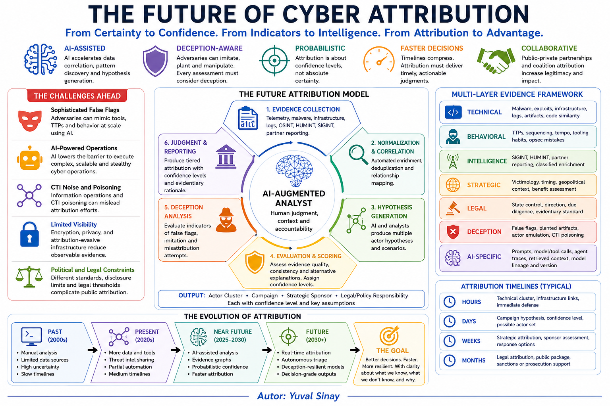

# Cyber Attribution

A public knowledge repository for structured cyber attribution frameworks, references, and analytical notes.

## Purpose

This repository supports disciplined cyber attribution analysis. It is intended for analysts, cyber threat intelligence teams, incident responders, policy advisers, legal advisers, and national security practitioners who need a structured way to reason about the source, sponsorship, intent, and confidence level of cyber and information influence operations.

The core principle is to separate evidence from assessment. Analysts should document what is observed, what is inferred, what is externally sourced, what remains uncertain, and how confidence is expressed.

## Scope

| Area | Focus |
| --- | --- |
| Cyber threat intelligence | CTI lifecycle, use cases, products, operating model, collection, processing, analysis, dissemination, and feedback |
| Detection engineering | Sigma, YARA, YARA-L, Snort, Suricata, capa, ClamAV, IOC, IOA, IoPC, detection rules, capability rules, antivirus signatures, indicator types, rule quality, telemetry coverage, and detection to attribution limits |
| Threat hunting and machine learning | Machine learning assisted threat hunting, algorithm selection, anomaly detection, clustering, feature engineering, analyst validation, and retro-hunting workflows |
| Defensive frameworks | MITRE D3FEND, MITRE Engage, ATT&CK-to-defense mapping, defensive countermeasures, denial, deception, adversary engagement, and control validation |
| Vulnerability intelligence | KEV, CVSS, EPSS, CWE, CAPEC, CPE, OSV, GSD, vulnerability prioritisation, weakness classes, attack patterns, exploit likelihood, product matching, open source vulnerability mapping, and exposure-driven remediation |
| Cyber attribution frameworks | Analytical frameworks, workflows, confidence language, and reasoning discipline |
| Adversary concealment | CLOAK, OpSec behavior, anonymity methods, anti-forensics, identity separation, and concealment-based behavioral fingerprinting |
| AI-based cyber attribution | AI-assisted evidence processing, graph analysis, explainable attribution, human-in-the-loop validation, and model limitations |
| Cyber attack creativity assessment | Defender-oriented scoring of attack novelty, trust exploitation, cross-domain integration, deception, operational planning, and paradigm-shifting effects |
| Offensive planning and targeting | High-level military, intelligence, and national-security planning frameworks used to understand targeting logic, prioritisation, and integration of cyber effects into broader operations |
| Influence operations attribution | Frameworks and workflows for Information Influence Operations (IIO) and FIMI analysis |
| Investigation techniques | Structured analytic techniques, alternative hypotheses, challenge analysis, and pre-mortem review |
| Incident response frameworks | Incident response lifecycles, playbooks, CSIRT maturity, evidence preservation, and post incident learning |
| Evidence evaluation | Technical evidence, source reliability, alternative hypotheses, and uncertainty |
| Technical attribution | Malware, infrastructure, TTPs, tooling, timing, victimology, and campaign patterns |
| Strategic attribution | Intent, geopolitical context, operational continuity, sponsorship, and state responsibility |
| AI age attribution | False flags, synthetic artifacts, automated analysis, deception, and information operations |

## Repository structure

```text
.
├── README.md
├── LICENSE.md
├── CITATION.cff
├── CODE_OF_CONDUCT.md
├── CONTRIBUTING.md
├── ROADMAP.md
├── SECURITY.md
├── Books/
│   └── Cyber-Attribution-Books.md
├── CLOAK-Concealment-Framework/
│   └── README.md
├── Cyber-Attack-Creativity/
│   ├── Criteria for Assessing the Creativity Level of Cyber Attacks v1.0.png
│   └── README.md
├── Frameworks/
│   ├── AI-Based-Cyber-Attribution.md
│   ├── Cyber-Attribution-Frameworks.md
│   ├── Defensive-Frameworks-and-Countermeasures.md
│   ├── Detection-Rule-Languages.md
│   ├── False-Flag-Cyber-Attribution.md
│   ├── Incident-Response-Frameworks.md
│   ├── Influence-Operations-(IIO)-Attribution.md
│   ├── Intro-to-Cyber-Threat-Intelligence.md
│   ├── Investigation-Techniques.md
│   ├── Offensive-Planning-and-Targeting-Frameworks.md
│   └── Vulnerability-Intelligence-Frameworks.md
├── Images/
│   └── Future-of-Cyber-Attribution.png
└── Threat-Hunting/
    └── Threat-Hunting-Machine-Learning-Algorithms.md
```

## Visual assets




## Main documents

For books and recommended reading:

[Cyber Attribution Books](Books/Cyber-Attribution-Books.md)

For cyber attribution frameworks and core analytical methods:

[Cyber Attribution Frameworks](Frameworks/Cyber-Attribution-Frameworks.md)

For adversary concealment, OpSec behavior, anonymity methods, anti-forensics, threat hunting, and concealment-based attribution:

[CLOAK Concealment Framework](CLOAK-Concealment-Framework/README.md)

For AI-assisted attribution, explainable attribution, human-in-the-loop validation, and AI limitations:

[AI-Based Cyber Attribution](Frameworks/AI-Based-Cyber-Attribution.md)

For cyber attack creativity assessment and defender interpretation:

[Criteria for Assessing the Creativity Level of Cyber Attacks](Cyber-Attack-Creativity/README.md)

For defensive frameworks, countermeasure mapping, denial, deception, and adversary engagement:

[Defensive Frameworks and Countermeasures](Frameworks/Defensive-Frameworks-and-Countermeasures.md)

For detection engineering rule languages, capability rule formats, antivirus signatures, and indicators:

[Detection Rule Languages](Frameworks/Detection-Rule-Languages.md)

For false flag cyber attribution frameworks and mitigation techniques:

[False Flag Cyber Attribution](Frameworks/False-Flag-Cyber-Attribution.md)

For incident response frameworks:

[Incident Response Frameworks](Frameworks/Incident-Response-Frameworks.md)

For information influence operations:

[Influence Operations (IIO) Attribution](Frameworks/Influence-Operations-%28IIO%29-Attribution.md)

For an introduction to cyber threat intelligence:

[Intro to Cyber Threat Intelligence](Frameworks/Intro-to-Cyber-Threat-Intelligence.md)

For structured investigation techniques:

[Investigation Techniques](Frameworks/Investigation-Techniques.md)

For offensive planning, targeting frameworks, target prioritisation, and the integration of cyber effects into broader operations:

[Offensive Planning and Targeting Frameworks](Frameworks/Offensive-Planning-and-Targeting-Frameworks.md)

For machine learning assisted threat hunting algorithms, feature engineering, validation, and analyst review safeguards:

[Threat Hunting Machine Learning Algorithms](Threat-Hunting/Threat-Hunting-Machine-Learning-Algorithms.md)

For vulnerability intelligence, prioritisation, weakness classes, product matching, open source vulnerability mapping, and attack patterns:

[Vulnerability Intelligence Frameworks](Frameworks/Vulnerability-Intelligence-Frameworks.md)

## Analytical layers

| Layer | Main question | Example output |
| --- | --- | --- |
| Technical attribution | What infrastructure, tools, malware, and behaviors were used? | Actor cluster, campaign family, technical indicators |
| Operational attribution | How was the operation planned and executed? | Campaign model, operational pattern, intrusion lifecycle |
| Strategic attribution | Why was the operation conducted, and who benefits? | Motive, intent, geopolitical context |
| Legal attribution | Can conduct be attributed to a state or legally responsible entity? | State responsibility assessment |
| Policy attribution | How should the assessment support response? | Public attribution, diplomacy, sanctions, legal action, or defensive response |

## Governance and contribution files

| File | Purpose |
| --- | --- |
| [CITATION.cff](CITATION.cff) | Citation metadata for academic and professional reuse |
| [CONTRIBUTING.md](CONTRIBUTING.md) | Contribution guidance and quality expectations |
| [SECURITY.md](SECURITY.md) | Security reporting and safe-content principles |
| [CODE_OF_CONDUCT.md](CODE_OF_CONDUCT.md) | Professional conduct expectations |
| [ROADMAP.md](ROADMAP.md) | Planned development priorities |

## External reference anchors

The repository links to external resources rather than copying their content. Key anchors include CTI lifecycle and capability guidance, defensive frameworks, MITRE D3FEND, MITRE Engage, detection engineering rule languages and formats, Sigma, YARA, YARA-L, Snort, Suricata, capa, ClamAV, IOC, IOA, IoPC, machine learning assisted threat hunting, anomaly detection, clustering, classification, graph analytics, AI-based cyber attribution, explainable AI, human-in-the-loop attribution, trustworthy AI, KEV, CVSS, EPSS, CWE, CAPEC, CPE, OSV, GSD, cyber attribution books and reading lists, ODNI cyber attribution guidance, the Diamond Model, offensive planning and targeting frameworks, Joint Targeting Cycle, F2T2EA, F3EAD, CARVER, DIMEFIL, structured analytic techniques, MITRE ATT&CK, CLOAK, Attack Flow, STIX 2.1, TAXII 2.1, FIRST TLP 2.0, IIO/FIMI attribution frameworks, false flag cyber attribution, incident response frameworks, CSIRT maturity guidance, CISA/NIST/ISO/ENISA/NCSC incident management guidance, cyber attack creativity assessment, defender-oriented creativity scoring, and legal scholarship on state responsibility and public attribution.

## Citation

Sinay, Y. (2026). *Cyber Attribution*. GitHub. https://github.com/yuval14/Cyber-Attribution

## License

Original repository content is authored by Yuval Sinay and licensed under CC BY 4.0 unless a specific file states otherwise.